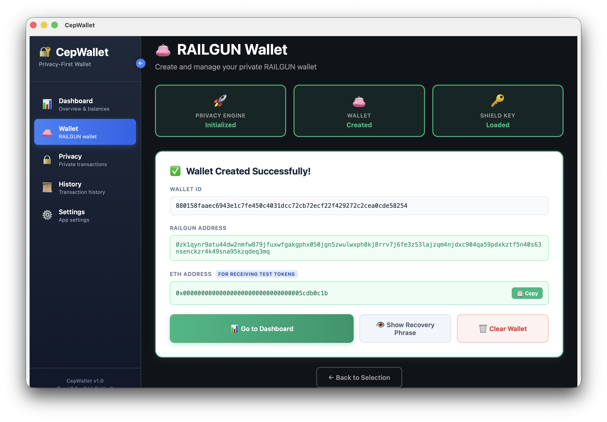
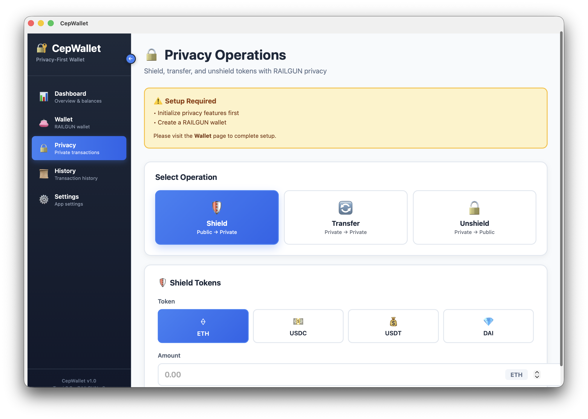
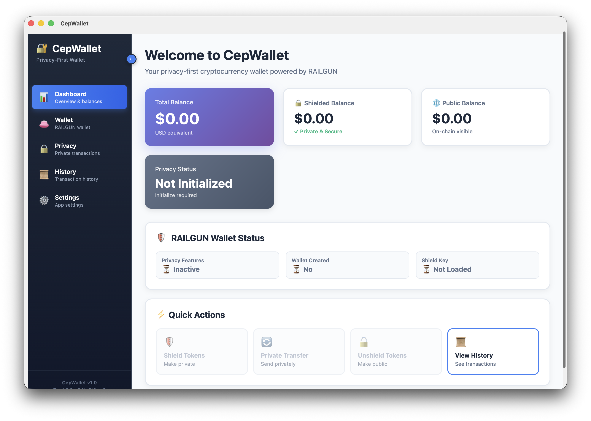
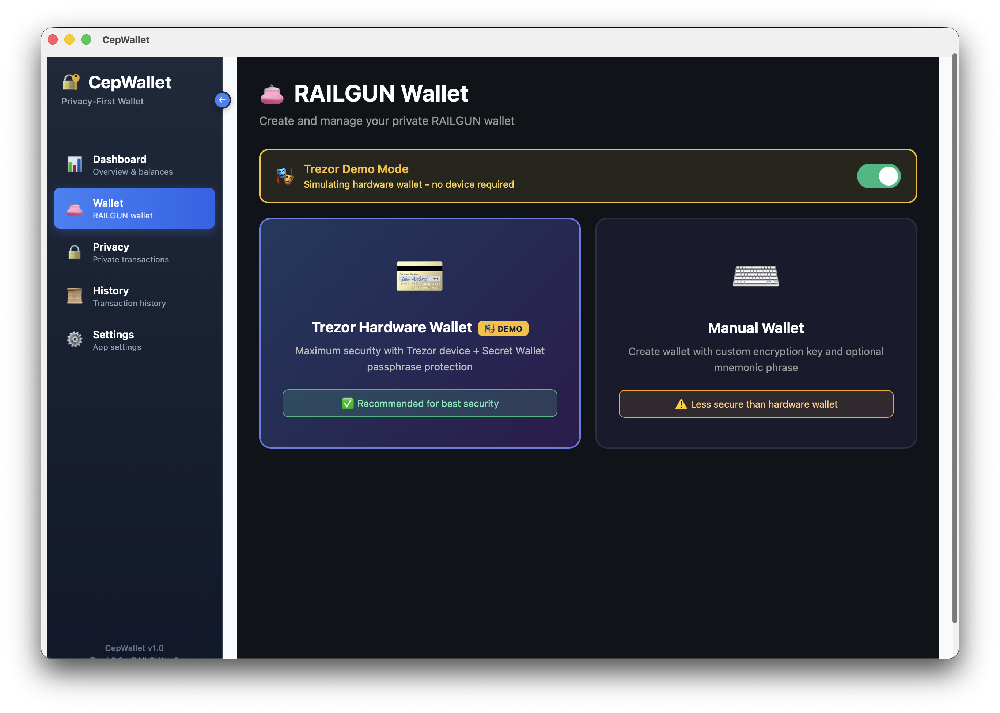
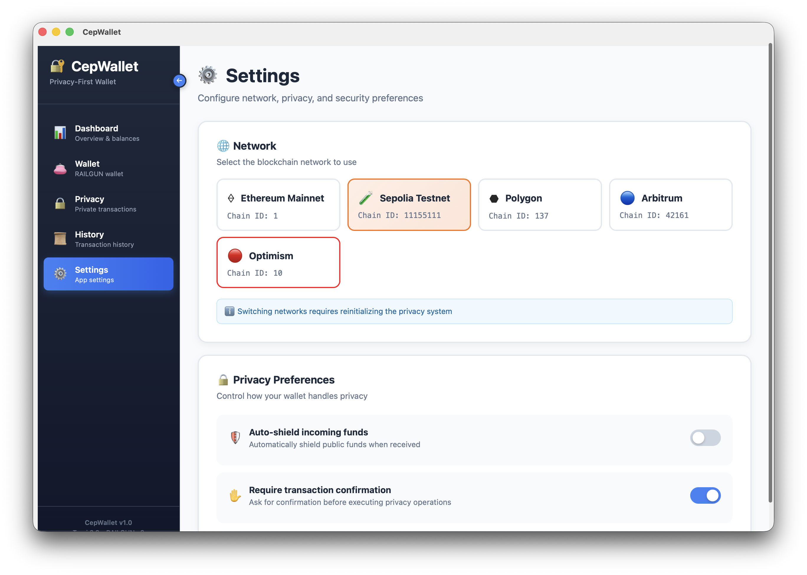

# CepWallet - Privacy-First Hardware Wallet

<div align="center">

**Secure • Privacy-First • Web3 Native • Trezor Powered**

[](https://www.gnu.org/licenses/gpl-3.0)
[]()
[]()
[]()

[Quick Start](QUICKSTART.md) •
[Documentation](docs/INDEX.md) •
[Privacy Features](#-privacy-features-kohaku) •
[Roadmap](docs/ROADMAP.md)

</div>

---

## 🎯 Project Summary

**CepWallet** is a **privacy-first** crypto wallet + Web3 browser application developed by combining Trezor hardware wallet security with **Ethereum Foundation's Kohaku** privacy protocols.

### 🔐 Key Features

#### Hardware Security (Trezor)
- ✅ USB-based hardware wallet (cold wallet)
- ✅ Private keys never leave the device
- ✅ Transaction signing completely offline
- ✅ PIN protection & recovery phrase
- ✅ BIP32/39/44 HD wallet support

#### 🕵️ Privacy Features (Kohaku)
- ✅ **RAILGUN Protocol**: Zero-knowledge shielded transactions
- ✅ **Privacy Pools**: Compliance-friendly privacy
- ✅ **Privacy Levels**: User-selectable modes
- ✅ **Anonymous DeFi**: Private swaps, lending, staking

#### 🌐 Web3 Integration
- ✅ Cross-platform support (Windows, macOS, Linux, iOS)
- ✅ Customized web browser for Web3 interaction
- ✅ Direct integration with dApps like Uniswap, OpenSea
- ✅ Multi-chain support (Ethereum, BSC, Polygon, Arbitrum)

---

## 🛡️ Privacy Features (Kohaku)

### Zero-Knowledge Privacy

CepWallet provides the following features using **Kohaku** privacy tooling from the Ethereum Foundation:

#### 1. RAILGUN Shielded Transactions

**RAILGUN** provides zero-knowledge proof-based privacy on Ethereum.

**How It Works:**
```
Normal Transaction:
Alice → [100 ETH visible] → Bob
❌ Everyone can see: from whom to whom, how much

With RAILGUN:
Alice → [Shield] → [Private Pool] → [Unshield] → Bob
✅ Only Alice and Bob know the amount
✅ Only proof is visible on-chain
```



**Code Example:**
```typescript
// Send public ETH to RAILGUN private pool
await wallet.shield({
  token: '0x0', // ETH
  amount: '1.0'
});

// Private transfer (amount and recipient hidden)
await wallet.shieldedTransfer({
  to: '0xRECIPIENT_RAILGUN_ADDRESS',
  token: '0x0',
  amount: '0.5'
});

// Withdraw from private pool to public address
await wallet.unshield({
  token: '0x0',
  amount: '0.3',
  to: '0xYOUR_PUBLIC_ADDRESS'
});
```

**Advantages:**
- 🔒 Transaction amounts completely hidden
- 🕵️ Recipient addresses anonymous
- 📊 On-chain analysis impossible
- ⚡ Gas-efficient ZK proofs

#### 2. Privacy Pools (Compliance-Friendly)

Privacy Pools combine regulatory compliance with privacy.

**Features:**
- 🌊 Pool-based private transfers
- 📋 Regulatory compliance proofs
- 🔐 Zero-knowledge pool membership
- ⚖️ Privacy with legal assurance



**Code Example:**
```typescript
// Join privacy pool
await wallet.joinPool({
  poolId: 'compliance-pool-1',
  amount: '10.0',
  token: '0x0'
});

// Private transfer within pool
await wallet.poolTransfer({
  to: '0xRECIPIENT',
  amount: '2.5',
  includeComplianceProof: true
});
```

#### 3. Privacy Levels

Users can select privacy levels:

| Level | Description | Use Case |
|-------|-------------|----------|
| 🌐 **Public** | Standard Ethereum | Normal transactions |
| 🛡️ **RAILGUN** | Shielded transactions | Private DeFi |
| 🌊 **Privacy Pool** | Compliance-friendly | Corporate use |
| 🔒 **Maximum** | RAILGUN + Privacy Pool | Maximum privacy |

---

## 🌟 Why CepWallet?

### vs Standard Trezor
- ✅ **Privacy**: Private transactions with Kohaku protocol
- ✅ **Modern UI**: Custom application, not Trezor Suite
- ✅ **Web3 Focused**: Direct dApp access with built-in browser

### vs MetaMask
- ✅ **Hardware Security**: Private keys on USB device
- ✅ **Privacy**: Transaction privacy (Kohaku)
- ✅ **Standalone**: Full application, not browser extension

### vs Other Privacy Wallets
- ✅ **Hardware Security**: More secure than software wallets
- ✅ **Proven Protocol**: Ethereum Foundation support
- ✅ **Open Source**: Fully transparent

---

## 🚀 Quick Start

### For Users

1. **Get a Trezor Device**
   - Purchase Trezor One or Model T
   - From https://trezor.io

2. **Download CepWallet**
   - From [Releases](https://github.com/zinderud/cepwallet/releases) page
   - Choose Windows, macOS or Linux version

3. **Install**
   - Connect Trezor to your computer
   - Launch CepWallet
   - Complete wallet setup

4. **Start Using Web3**
   - Access dApps like Uniswap, OpenSea with built-in browser
   - Activate privacy features
   - Make secure transactions!

### For Developers

For detailed setup and development:

👉 **[QUICKSTART.md](QUICKSTART.md)** - Get started in 10 minutes  
👉 **[docs/GETTING_STARTED.md](docs/GETTING_STARTED.md)** - Detailed guide

```bash
# 🚀 Quick start - Single command with Tauri!
git clone https://github.com/zinderud/cepwallet.git
cd cepwallet
pnpm install
pnpm tauri dev
```

> **🎉 New:** Now works with a single command! `pnpm tauri dev`

---

## 📁 Project Structure

```
cepwallet/
├── README.md                    # This file
├── QUICKSTART.md               # Quick start
├── TAURI_MIGRATION_COMPLETE.md # ✨ Tauri migration report
├── LICENSE                      # GPL v3
│
├── docs/                        # Documentation
│   ├── INDEX.md                # Documentation index
│   ├── GETTING_STARTED.md      # Detailed start
│   ├── ARCHITECTURE.md         # Technical architecture (Tauri)
│   ├── PRIVACY_FEATURES.md     # Kohaku integration
│   ├── HARDWARE.md             # Hardware development
│   ├── PROJECT_STRUCTURE.md    # Project structure
│   └── ROADMAP.md              # Roadmap
│
├── cepwallet/                   # 🎉 Tauri Desktop App
│   ├── src-tauri/              # Rust backend (Trezor, Crypto)
│   │   └── src/
│   │       ├── main.rs         # Tauri entry + commands
│   │       ├── commands.rs     # IPC handlers
│   │       ├── hardware/       # Trezor, USB
│   │       ├── crypto/         # Wallet operations
│   │       └── utils/
│   ├── src/                    # React frontend
│   └── package.json
│
├── bridge/                      # ⚠️  Deprecated (migrated to Tauri)
```

Detailed structure: [docs/PROJECT_STRUCTURE.md](docs/PROJECT_STRUCTURE.md)

---

## 💡 Use Cases

### 1. Private DeFi Trading
```
Scenario: Alice wants to swap on Uniswap but keep her transaction private

1. Alice activates RAILGUN mode in CepWallet
2. Shields her ETH to RAILGUN pool
3. Opens Uniswap in built-in browser
4. Swaps directly from private pool
5. Keeps tokens in private pool
→ No one can see how much Alice swapped
```



### 2. NFT Privacy
```
Scenario: Bob bought a valuable NFT and wants to protect his identity privacy

1. Bob transfers NFT to privacy pool
2. Moves NFT to new address within pool
3. Withdraws to his real wallet
→ Connection between original buyer and current owner is broken
```



### 3. Corporate Compliance
```
Scenario: A company wants to pay employee salaries with privacy but remain auditable

1. Company uses Privacy Pool
2. Distributes salaries from within pool (amounts hidden)
3. Generates compliance proof if needed
4. Shows only necessary information to auditors
→ Employee privacy protected while audit possible
```



---

## 🗺️ Roadmap

### ✅ Phase 0: Platform Migration (COMPLETED)
- [x] **Electron → Tauri** migration
- [x] 97% smaller bundle size (~5MB vs 180MB)
- [x] 99% faster communication with native IPC
- [x] Single command deployment (`pnpm tauri dev`)
- [x] Type-safe IPC with Rust backend

### Phase 1: MVP (4-6 weeks) - Current
- [x] Research and planning
- [x] Tauri desktop app setup
- [x] Trezor integration (USB HID implementation)
- [x] Web3 browser integration
- [x] Basic privacy features (Kohaku)

### Phase 2: Advanced Features (6-8 weeks)
- [x] Multi-chain support
- [ ] Token & NFT management
- [ ] DeFi integrations
- [ ] Advanced security

### Phase 3: Mobile & Beta (8-12 weeks)
- [x] React Native app
- [ ] iOS/Android support
- [ ] Beta testing
- [ ] Community feedback

### Phase 4: Production (12+ weeks)
- [ ] v1.0 release
- [ ] Marketing
- [ ] Community growth
- [ ] Custom hardware (optional)

Detailed roadmap: [docs/ROADMAP.md](docs/ROADMAP.md)

---

 
## 🔒 Security

- **Hardware Isolation**: Private keys never leave the device
- **PIN Protection**: Device locks after 10 wrong attempts
- **Recovery Phrase**: 24-word BIP39 seed
- **Firmware Verification**: Signed firmware updates
- **Zero-Knowledge Proofs**: Transaction privacy
- **Open Source**: Auditable by community

Security reports and audits: [docs/SECURITY.md](docs/SECURITY.md)

---

## 🤝 Contributing

CepWallet is an open source project and we welcome your contributions!

1. Fork it
2. Create your feature branch (`git checkout -b feature/amazing-feature`)
3. Commit your changes (`git commit -m 'Add amazing feature'`)
4. Push to the branch (`git push origin feature/amazing-feature`)
5. Open a Pull Request

Detailed contribution guide: [CONTRIBUTING.md](CONTRIBUTING.md)

---

## 📝 License

This project is licensed under the [GNU General Public License v3.0](LICENSE).

---

## 📞 Contact

- **GitHub Issues**: [github.com/zinderud/cepwallet/issues](https://github.com/zinderud/cepwallet/issues)
 

---

## 🙏 Acknowledgments

- **Trezor** - Open source hardware wallet firmware
- **Ethereum Foundation** - Kohaku privacy protocols
- **RAILGUN** - Zero-knowledge privacy protocol
- **Community** - Feedback and contributions

---

<div align="center">

**⭐ Don't forget to star the project if you like it!**

Made with ❤️ by the CepWallet Team

</div>
